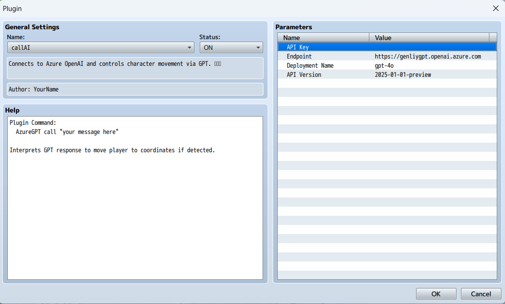

# 100GPTGames

**100GPTGames** is an experimental project that explores how large language models like OpenAI’s GPT can enhance and reimagine traditional game mechanics, storytelling, and interactivity. The goal is to create 100 playable AI demos within three years. Everyone is welcome to join or contribute to the project!

## 🌟 Level 1 - Catch the bat (10%)

In this case, using AI is like taking off the pants just to fart — totally unnecessary. But the main purpose of the first game is to expore how to intergate the LLM mode into the game. 

- **Game enigne**: RPG maker MV. RPG Maker is built by using JavaScript, which makes it easier to interact with LLM APIs.
- **LLM API**: Azure OpenAI.
- **How to play**: Catch the bat from behind.
- **AI function**: Create a plugin to call the Azure OpenAI service, then use it to control the game workflow and determine whether the player is behind the bat.

